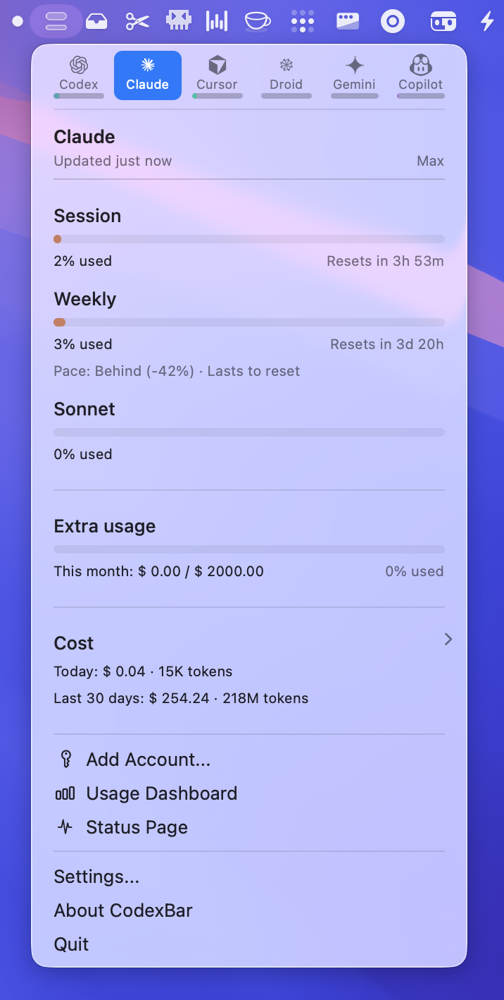
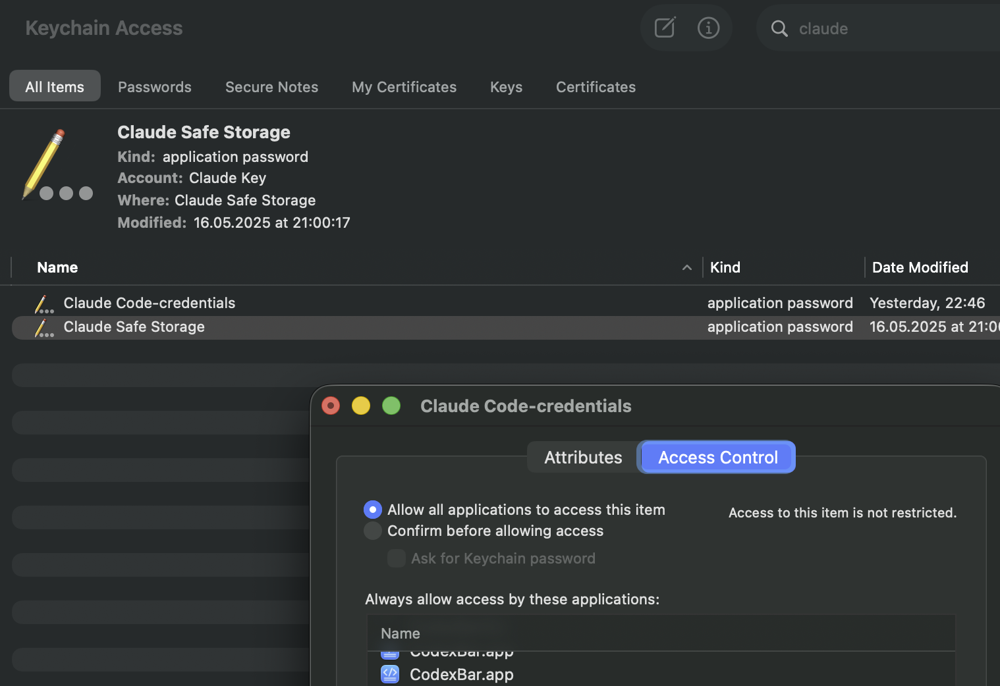

# CodexBar iOS

> **iPhone companion app for CodexBar.** Pulls every provider's usage from your Mac over iCloud, renders it as full-quality cards on your phone, and pushes a notification the moment any provider's quota hits zero.
>
> **This repository is the iOS app fork.** The Mac app lives in this same repo (forked from upstream) — **please download Mac builds from [our Releases page](https://github.com/o1xhack/CodexBar/releases)**, not from the upstream repo. The iOS app you install from the App Store is wire-locked to the Mac builds we ship here, and a mismatched upstream build will produce subtle data drift on your iPhone.

<p>
  <a href="https://apps.apple.com/app/id6760216772"></a>
</p>

🌐 [codexbarios.o1xhack.com](https://codexbarios.o1xhack.com) · 💻 [Mac app — GitHub Releases](https://github.com/o1xhack/CodexBar/releases) · 🐦 [@o1xhack](https://x.com/o1xhack)

## Highlights · 1.5.0

<table>
  <tr>
    <td width="33%" valign="top" align="center">
      <a href="CodexBarMobile/AppStoreScreenshots/v1-styled-en/01-overview.png"></a><br>
      <strong>Full sync</strong><br>
      <sub>All 27 providers — Codex, Claude, Cursor, Gemini, Vertex AI, Mistral, Abacus AI, Perplexity, Synthetic, and the rest — refreshed from your Mac via iCloud silent push within ~500 ms. One screen, no manual reload.</sub>
    </td>
    <td width="33%" valign="top" align="center">
      <a href="CodexBarMobile/AppStoreScreenshots/v1-styled-en/02-cost-overview.png"></a><br>
      <strong>Cost dashboard</strong><br>
      <sub>Daily Spend with 30-day chart, per-provider share, per-model breakdown, and renewal-cycle progress. Estimated rates kick in for newly-released models so a fresh <code>gpt-5.x</code> never silently drops the day to $0.</sub>
    </td>
    <td width="33%" valign="top" align="center">
      <a href="CodexBarMobile/AppStoreScreenshots/v1-styled-en/05-share-cards.png"></a><br>
      <strong>Share cards</strong><br>
      <sub>One-tap share images for any usage or cost view — clean dark-mode design with a QR back to the website. Ready for X, WeChat, Slack, or anywhere else you brag about token spend.</sub>
    </td>
  </tr>
</table>

---

# CodexBar iOS · iPhone 端伴侣应用

> **CodexBar 的 iPhone 伴侣 App。** 通过 iCloud 把你 Mac 上每个 provider 的用量数据拉到手机上，以高质量卡片展示，任何 provider 额度耗尽时第一时间推送通知。
>
> **本仓库是 iOS app fork**。Mac 应用与 iOS 都在这个 fork 仓库内 —— **请从[我们的 Releases 页面](https://github.com/o1xhack/CodexBar/releases)下载 Mac 版本**，不要从上游仓库下载。App Store 上的 iOS app 与我们这边发布的 Mac build 是 wire-locked 配套的，混用上游 Mac 会在 iPhone 上产生数据漂移。

<p>
  <a href="https://apps.apple.com/app/id6760216772"></a>
</p>

🌐 [codexbarios.o1xhack.com](https://codexbarios.o1xhack.com) · 💻 [Mac 版下载 — GitHub Releases](https://github.com/o1xhack/CodexBar/releases) · 🐦 [@o1xhack](https://x.com/o1xhack)

## 核心功能 · 1.5.0

<table>
  <tr>
    <td width="33%" valign="top" align="center">
      <a href="CodexBarMobile/AppStoreScreenshots/v1-styled-en/01-overview.png"></a><br>
      <strong>全量同步</strong><br>
      <sub>覆盖全部 27 个 provider —— Codex、Claude、Cursor、Gemini、Vertex AI、Mistral、Abacus AI、Perplexity、Synthetic 等 —— 通过 iCloud 静默推送从 Mac 同步到手机，~500 毫秒到达，一屏看全无需手动刷新。</sub>
    </td>
    <td width="33%" valign="top" align="center">
      <a href="CodexBarMobile/AppStoreScreenshots/v1-styled-en/02-cost-overview.png"></a><br>
      <strong>Cost 数据看板</strong><br>
      <sub>Daily Spend + 30 天柱图、每个 provider 占比、每个模型分账、计费周期进度。新发布的模型自动启用估算单价，<code>gpt-5.x</code> 出现的当天 Daily Spend 不会悄无声息归零。</sub>
    </td>
    <td width="33%" valign="top" align="center">
      <a href="CodexBarMobile/AppStoreScreenshots/v1-styled-en/05-share-cards.png"></a><br>
      <strong>分享卡片</strong><br>
      <sub>任意用量 / cost 视图一键生成分享图 —— 深色风格简约设计，附带网站 QR 码，可直接发 X、微信、Slack 或其他平台。</sub>
    </td>
  </tr>
</table>

---

# CodexBar 🎚️ - May your tokens never run out.

Tiny macOS 14+ menu bar app that keeps your Codex, Claude, Cursor, Gemini, Antigravity, Droid (Factory), Copilot, z.ai, Kiro, Vertex AI, Augment, Amp, JetBrains AI, OpenRouter, Perplexity, and Abacus AI limits visible (session + weekly where available) and shows when each window resets. One status item per provider (or Merge Icons mode with a provider switcher and optional Overview tab); enable what you use from Settings. No Dock icon, minimal UI, dynamic bar icons in the menu bar.



## Install

### Requirements
- macOS 14+ (Sonoma)

### GitHub Releases
Download: <https://github.com/steipete/CodexBar/releases>

### Homebrew
```bash
brew install --cask steipete/tap/codexbar
```

### Linux (CLI only)
```bash
brew install steipete/tap/codexbar
```
Or download `CodexBarCLI-v<tag>-linux-<arch>.tar.gz` from GitHub Releases.
Linux support via Omarchy: community Waybar module and TUI, driven by the `codexbar` executable.

### First run
- Open Settings → Providers and enable what you use.
- Install/sign in to the provider sources you rely on (e.g. `codex`, `claude`, `gemini`, browser cookies, or OAuth; Antigravity requires the Antigravity app running).
- Optional: Settings → Providers → Codex → OpenAI cookies (Automatic or Manual) to add dashboard extras.

## Providers

- [Codex](docs/codex.md) — Local Codex CLI RPC (+ PTY fallback) and optional OpenAI web dashboard extras.
- [Claude](docs/claude.md) — OAuth API or browser cookies (+ CLI PTY fallback); session + weekly usage.
- [Cursor](docs/cursor.md) — Browser session cookies for plan + usage + billing resets.
- [Gemini](docs/gemini.md) — OAuth-backed quota API using Gemini CLI credentials (no browser cookies).
- [Antigravity](docs/antigravity.md) — Local language server probe (experimental); no external auth.
- [Droid](docs/factory.md) — Browser cookies + WorkOS token flows for Factory usage + billing.
- [Copilot](docs/copilot.md) — GitHub device flow + Copilot internal usage API.
- [z.ai](docs/zai.md) — API token (Keychain) for quota + MCP windows.
- [Kimi](docs/kimi.md) — Auth token (JWT from `kimi-auth` cookie) for weekly quota + 5‑hour rate limit.
- [Kimi K2](docs/kimi-k2.md) — API key for credit-based usage totals.
- [Kiro](docs/kiro.md) — CLI-based usage via `kiro-cli /usage` command; monthly credits + bonus credits.
- [Vertex AI](docs/vertexai.md) — Google Cloud gcloud OAuth with token cost tracking from local Claude logs.
- [Augment](docs/augment.md) — Browser cookie-based authentication with automatic session keepalive; credits tracking and usage monitoring.
- [Amp](docs/amp.md) — Browser cookie-based authentication with Amp Free usage tracking.
- [JetBrains AI](docs/jetbrains.md) — Local XML-based quota from JetBrains IDE configuration; monthly credits tracking.
- [OpenRouter](docs/openrouter.md) — API token for credit-based usage tracking across multiple AI providers.
- [Abacus AI](docs/abacus.md) — Browser cookie auth for ChatLLM/RouteLLM compute credit tracking.
- Open to new providers: [provider authoring guide](docs/provider.md).

## Icon & Screenshot
The menu bar icon is a tiny two-bar meter:
- Top bar: 5‑hour/session window. If weekly is missing/exhausted and credits are available, it becomes a thicker credits bar.
- Bottom bar: weekly window (hairline).
- Errors/stale data dim the icon; status overlays indicate incidents.

## Features
- Multi-provider menu bar with per-provider toggles (Settings → Providers).
- Session + weekly meters with reset countdowns.
- Optional Codex web dashboard enrichments (code review remaining, usage breakdown, credits history).
- Local cost-usage scan for Codex + Claude (last 30 days).
- Provider status polling with incident badges in the menu and icon overlay.
- Merge Icons mode to combine providers into one status item + switcher, with an optional Overview tab for up to three providers.
- Refresh cadence presets (manual, 1m, 2m, 5m, 15m).
- Bundled CLI (`codexbar`) for scripts and CI (including `codexbar cost --provider codex|claude` for local cost usage); Linux CLI builds available.
- WidgetKit widget mirrors the menu card snapshot.
- Privacy-first: on-device parsing by default; browser cookies are opt-in and reused (no passwords stored).

## Privacy note
Wondering if CodexBar scans your disk? It doesn’t crawl your filesystem; it reads a small set of known locations (browser cookies/local storage, local JSONL logs) when the related features are enabled. See the discussion and audit notes in [issue #12](https://github.com/steipete/CodexBar/issues/12).

## macOS permissions (why they’re needed)
- **Full Disk Access (optional)**: only required to read Safari cookies/local storage for web-based providers (Codex web, Claude web, Cursor, Droid/Factory). If you don’t grant it, use Chrome/Firefox cookies or CLI-only sources instead.
- **Keychain access (prompted by macOS)**:
  - Chrome cookie import needs the “Chrome Safe Storage” key to decrypt cookies.
  - Claude OAuth credentials (written by the Claude CLI) are read from Keychain when present.
  - z.ai API token is stored in Keychain from Preferences → Providers; Copilot stores its API token in Keychain during device flow.
  - **How do I prevent those keychain alerts?**
    - Open **Keychain Access.app** → login keychain → search the item (e.g., “Claude Code-credentials”).
    - Open the item → **Access Control** → add `CodexBar.app` under “Always allow access by these applications”.
    - Prefer adding just CodexBar (avoid “Allow all applications” unless you want it wide open).
    - Relaunch CodexBar after saving.
    - Reference screenshot: 
  - **How to do the same for the browser?**
    - Find the browser’s “Safe Storage” key (e.g., “Chrome Safe Storage”, “Brave Safe Storage”, “Firefox”, “Microsoft Edge Safe Storage”).
    - Open the item → **Access Control** → add `CodexBar.app` under “Always allow access by these applications”.
    - This removes the prompt when CodexBar decrypts cookies for that browser.
- **Files & Folders prompts (folder/volume access)**: CodexBar launches provider CLIs (codex/claude/gemini/antigravity). If those CLIs read a project directory or external drive, macOS may ask CodexBar for that folder/volume (e.g., Desktop or an external volume). This is driven by the CLI’s working directory, not background disk scanning.
- **What we do not request**: no Screen Recording, Accessibility, or Automation permissions; no passwords are stored (browser cookies are reused when you opt in).

## Docs
- Providers overview: [docs/providers.md](docs/providers.md)
- Provider authoring: [docs/provider.md](docs/provider.md)
- Issue labeling guide: [docs/ISSUE_LABELING.md](docs/ISSUE_LABELING.md)
- UI & icon notes: [docs/ui.md](docs/ui.md)
- CLI reference: [docs/cli.md](docs/cli.md)
- Architecture: [docs/architecture.md](docs/architecture.md)
- Refresh loop: [docs/refresh-loop.md](docs/refresh-loop.md)
- Status polling: [docs/status.md](docs/status.md)
- Sparkle updates: [docs/sparkle.md](docs/sparkle.md)
- Release checklist: [docs/RELEASING.md](docs/RELEASING.md)

## Getting started (dev)
- Clone the repo and open it in Xcode or run the scripts directly.
- Launch once, then toggle providers in Settings → Providers.
- Install/sign in to provider sources you rely on (CLIs, browser cookies, or OAuth).
- Optional: set OpenAI cookies (Automatic or Manual) for Codex dashboard extras.

## Build from source
```bash
swift build -c release          # or debug for development
./Scripts/package_app.sh        # builds CodexBar.app in-place
CODEXBAR_SIGNING=adhoc ./Scripts/package_app.sh  # ad-hoc signing (no Apple Developer account)
open CodexBar.app
```

Dev loop:
```bash
./Scripts/compile_and_run.sh
```

## Related
- ✂️ [Trimmy](https://github.com/steipete/Trimmy) — “Paste once, run once.” Flatten multi-line shell snippets so they paste and run.
- 🧳 [MCPorter](https://mcporter.dev) — TypeScript toolkit + CLI for Model Context Protocol servers.
- 🧿 [oracle](https://askoracle.dev) — Ask the oracle when you're stuck. Invoke GPT-5 Pro with a custom context and files.

## Looking for a Windows version?
- [Win-CodexBar](https://github.com/Finesssee/Win-CodexBar)

## Credits
Inspired by [ccusage](https://github.com/ryoppippi/ccusage) (MIT), specifically the cost usage tracking.

## License
MIT • Peter Steinberger ([steipete](https://twitter.com/steipete))
