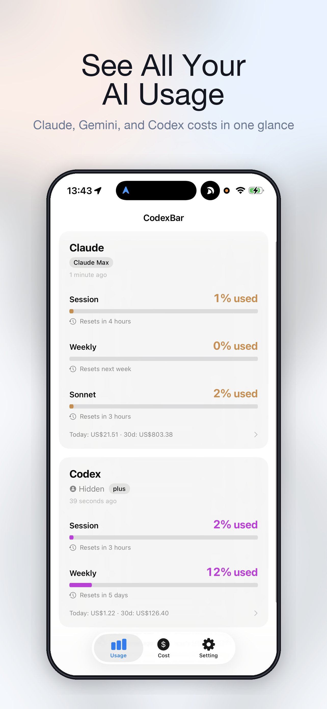
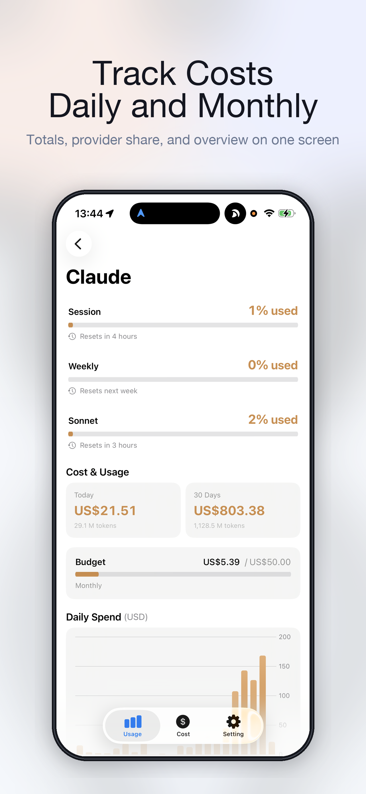
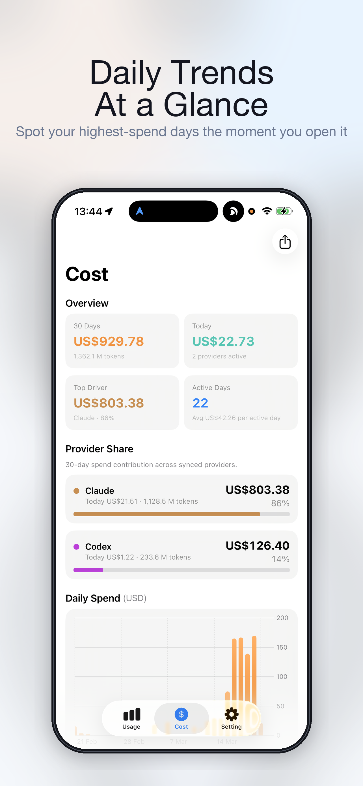
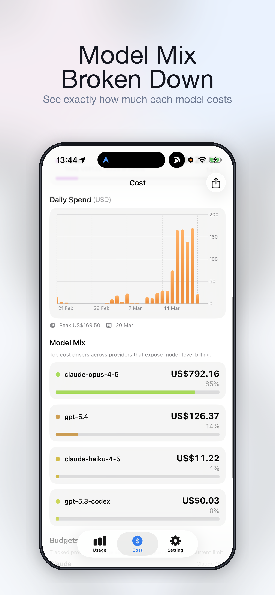
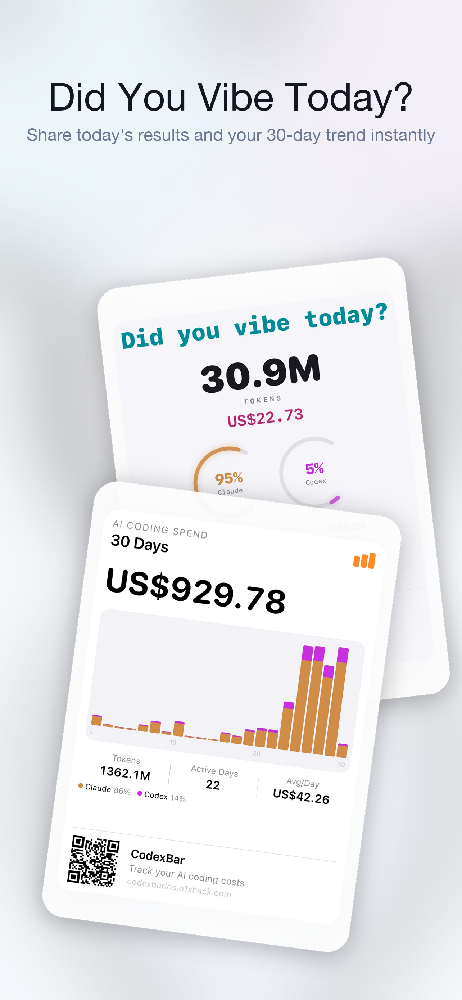

# CodexBar iOS · iPhone 端伴侣应用

[🇬🇧 English](README.md)

> **CodexBar 的 iPhone 伴侣 App。** 通过 iCloud 把你 Mac 上每个 provider 的用量数据拉到手机上，以高质量卡片展示，任何 provider 额度耗尽时第一时间推送通知。
>
> **本仓库是 iOS app fork**。Mac 应用与 iOS 都在这个 fork 仓库内 —— **请从[我们的 Releases 页面](https://github.com/o1xhack/CodexBar/releases)下载 Mac 版本**，不要从上游仓库下载。App Store 上的 iOS app 与我们这边发布的 Mac build 是 wire-locked 配套的，混用上游 Mac 会在 iPhone 上产生数据漂移。

  

🌐 [codexbarios.o1xhack.com](https://codexbarios.o1xhack.com) · 💻 [Mac 版下载 — GitHub Releases](https://github.com/o1xhack/CodexBar/releases) · 🐦 [@o1xhack](https://x.com/o1xhack)

## 核心功能 · 1.5.0

  
  
  
  
  

- **全量同步** —— 覆盖全部 27 个 provider（Codex、Claude、Cursor、Gemini、Vertex AI、Mistral、Abacus AI、Perplexity、Synthetic 等），通过 iCloud 静默推送从 Mac 同步到手机，~500 毫秒到达，一屏看全无需手动刷新。
- **Cost 数据看板** —— Daily Spend + 30 天柱图、每个 provider 占比、每个模型分账、计费周期进度。新发布的模型自动启用估算单价，`gpt-5.x` 出现的当天 Daily Spend 不会悄无声息归零。
- **分享卡片** —— 任意用量 / cost 视图一键生成分享图，深色风格简约设计，附带网站 QR 码，可直接发 X、微信、Slack 或其他平台。

---

> Mac 应用的功能列表、安装方法、各 provider 详细配置说明仅有英文版，请参考 [English README](README.md#codexbar-️---may-your-tokens-never-run-out) 中下半部分（来源于上游仓库）。
