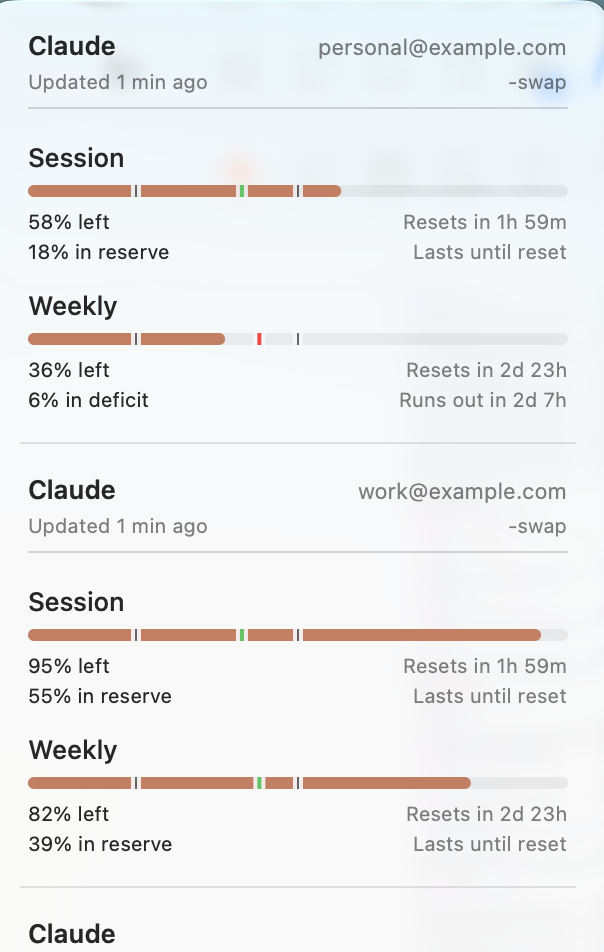
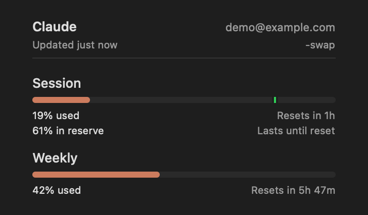
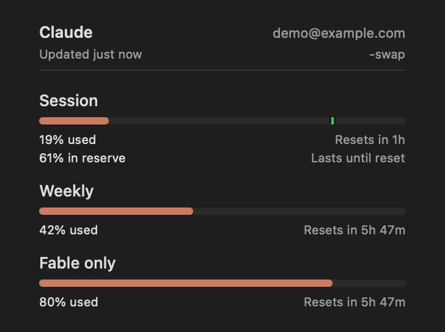
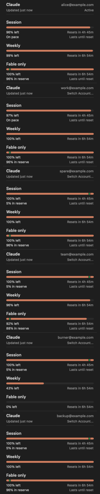
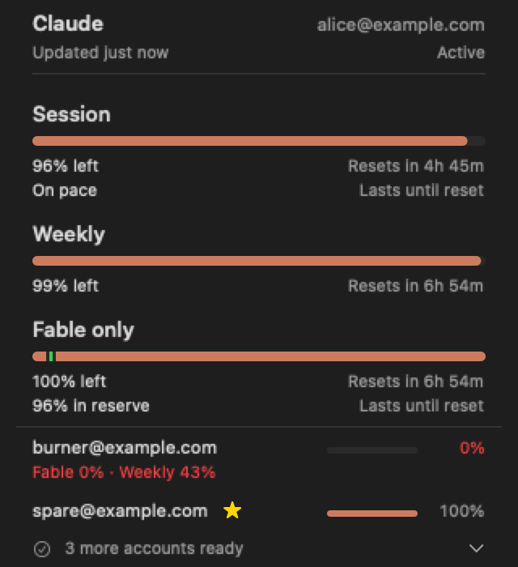

# Claude provider

Claude Web distinguishes Cloudflare challenges from expired sessions. The menu directs a
challenged account to Claude provider settings for an OAuth source or network change while
keeping cached cookies and the last successful usage. A successful CLI quota read can offer
account actions even when optional identity fields are absent. Restored percentage-only history
shows a neutral limited-detail note, and model-scoped weekly labels are localized in the menu.

Claude supports three usage data paths plus local cost usage. The main provider pipeline uses runtime-specific
automatic selection, but the codebase still has multiple active Claude `.auto` decision sites while the refactor is
pending. For the exact current-state parity contract, see
[docs/refactor/claude-current-baseline.md](refactor/claude-current-baseline.md).

When an Anthropic Admin API key is configured, Claude can also show organization-level spend/messages/tokens in the
same inline dashboard pattern used by the OpenAI API provider.

## Data sources + selection order

### Default selection (debug menu disabled)
- If an Admin API key is configured, the Admin API strategy is used for Claude API spend/usage.
- App runtime main pipeline: OAuth API → CLI PTY → Web API.
- CLI runtime main pipeline: Web API → CLI PTY.
- Explicit picker modes (OAuth/Web/CLI) bypass automatic fallback.
- A lower-level direct Claude fetcher still contains a separate `.auto` order. That inconsistency is tracked in
  [docs/refactor/claude-current-baseline.md](refactor/claude-current-baseline.md).

Usage source picker:
- Preferences → Providers → Claude → Usage source (Auto/OAuth/Web/CLI).

Admin API key setup:
- Preferences → Providers → Claude → Admin API key, stored in `~/.quotakit/config.json`.
- CLI/env: `printf '%s' "$ANTHROPIC_ADMIN_KEY" | quotakit config set-api-key --provider claude --stdin`.
- Token accounts can also hold `sk-ant-admin...` keys; they route to the Admin API instead of cookie/OAuth usage.
- Environment fallback: `ANTHROPIC_ADMIN_KEY`.

## Admin API
- Key prefix: `sk-ant-admin...`.
- Endpoints:
  - `/v1/organizations/cost_report`
  - `/v1/organizations/usage_report/messages`
- Output:
  - Today/7d/30d spend and message/token summaries.
  - Inline 30-day dashboard chart when daily buckets are present.
  - Identity login method: `Admin API`.

### Optional workspace spend

Enable **Show workspace spend** in Settings → Providers → Claude, set `claudeWorkspaceSpendEnabled: true` on the
Claude provider config entry, or set `ANTHROPIC_ADMIN_WORKSPACE_SPEND=true`. It is off by default and applies only
to the Admin API source.

The existing [cost report](https://platform.claude.com/docs/en/api/admin/cost_report/retrieve) request adds
`group_by[]=workspace_id` alongside `group_by[]=description`; no extra request or credentials are required.
The organization totals, cost items, token summaries, and daily chart remain unchanged. When more than one workspace
has cost rows, **Workspace spend · 30d** shows up to 20 workspaces, highest spend first, over the same 30-day buckets
as the organization total. Labels use workspace IDs; a null workspace is **Default**. Amounts are converted from
Anthropic's USD cents to dollars. A single workspace keeps the existing organization view.

## Keychain prompt policy (Claude OAuth)
- Preferences → Providers → Claude → Keychain prompt policy.
- Options:
  - `Never prompt`: never attempts interactive Claude OAuth Keychain prompts.
  - `Only on user action` (default): interactive prompts are reserved for user-initiated repair flows.
  - `Always allow prompts`: allows interactive prompts in both user and background flows.
- A user-initiated OAuth load can repair Claude Keychain access when direct-read consent is enabled and the policy
  allows prompts. Background OAuth loads remain noninteractive, including with `Always allow prompts`; that policy
  still governs the existing delegated refresh and experimental reader paths.
- This setting only affects Claude OAuth Keychain prompting behavior; it does not switch your Claude usage source.
- The experimental `/usr/bin/security` reader follows the stored policy: background reads that can prompt require
  `Always allow prompts` and an explicitly permitted QuotaKit operation. `Never prompt` blocks this reader.
- If Preferences → Advanced → Disable Keychain access is enabled, this policy remains visible but inactive until
  Keychain access is re-enabled.
- An expired cached token is checked against the live Claude Keychain entry when no-prompt access is available;
  background refresh does not open an interactive Keychain prompt.

### Debug selection (debug menu enabled)
- The Debug pane can force OAuth / Web / CLI.
- Web extras are internal-only (not exposed in the Providers pane).

## OAuth API (preferred)
- OAuth refresh form-encodes credential values, preserving literal plus signs and other reserved characters.
- Credentials:
  - QuotaKit OAuth cache when available.
  - File fallback: `~/.claude/.credentials.json`.
  - Claude CLI Keychain bootstrap/repair fallback: `Claude Code-credentials`.
- When a QuotaKit-owned OAuth cache item's ACL rejects the current build, fresh credentials from an allowed source
  can replace that cache item using no-UI deletion and creation. A locked or inconclusive Keychain is preserved;
  failed ACL repairs back off for five minutes. This never deletes or recreates Claude Code's credential item.
- If QuotaKit's cache is temporarily unavailable, automatic refreshes can reuse an unexpired credential already in
  memory beyond the normal 30-minute cache window, ahead of a stale credentials file. Each refresh retries the
  persistent cache. Token expiry, profile changes, cache invalidation, and Never prompt still prevent reuse;
  after a rejected cache write, the next refresh first clears the stale persistent entry, then reuses and persists
  an unexpired in-memory credential even after 30 minutes once that cleanup succeeds. Extended reuse requires
  evidence of that exact failed write and its original consent; an unrelated invalidation cannot authorize it.
  Rejected writes during QuotaKit-owned token refresh retain the same recovery, bound to the refreshed credential;
  a delayed older write cannot replace a newer credential's recovery. This does not discover an external login or
  enable additional background reads of Claude Code's Keychain item.
- For the default CLI profile, expired cached or file credentials can adopt a fresh CLI Keychain token after file
  fallback, even when its fingerprint was already observed during an earlier repair. Existing direct-read consent,
  prompt policy, cooldown, one-minute freshness-check throttle, and noninteractive-read checks still apply. Custom
  profiles are not recovered from the unscoped global item, and CLI credentials are never rewritten by this
  synchronization. Background recovery still requires the Always allow prompts policy; the default Only on user
  action policy requires an explicit Refresh.
- Credential selection does not rank unrelated sources by the largest `expiresAt`: expiry establishes validity,
  not account identity or issuance order. A valid profile file remains ahead of Keychain bootstrap. Keychain
  candidates are ordered by modification date (creation date as fallback); freshness sync reads only that newest
  item and never rewrites Claude Code's credentials file. An expired default-profile record can be replaced even
  when the stored Keychain fingerprint already matches, subject to the access gates above.
- On Claude Code 2.1.x, `Claude Code-credentials` may contain only MCP server OAuth state (`mcpOAuth`) with no
  `claudeAiOauth`. QuotaKit treats that as an OAuth configuration error, does not run background delegated
  `claude /status` refresh, and surfaces re-auth guidance. Use Web or CLI usage source, or restore a valid Claude
  OAuth keychain entry. See #1844.
- Requires `user:profile` scope (CLI tokens with only `user:inference` cannot call usage).
- Missing-scope recovery requires a Claude Code sign-in token with `user:profile` usage access. `claude setup-token`
  creates a model-request token, not a usage-scope token. Before switching Claude Source to Web/CLI, remove any
  configured OAuth token override.
- Endpoints:
  - `GET https://api.anthropic.com/api/oauth/usage?cedar_ember=1` → quota, spend, cloud-session credits, and saved limit-reset inventory.
    HTTP 400 or a non-scope 403 retries once without the optional query; missing-scope 403, 401, and 429 keep their
    existing handling. Spending stays in the same request.
  - `GET https://api.anthropic.com/api/oauth/profile` → account identity used to verify that optional Web enrichment
    belongs to the same Claude account.
- Headers:
  - `Authorization: Bearer <access_token>`
  - `anthropic-beta: oauth-2025-04-20`
  - The inventory request uses `claude-cli/<detected-version> (external, cli)`; the retry uses the legacy
    `claude-code/<detected-version>` identity.
- Mapping:
  - `five_hour` → session window.
  - `seven_day` → weekly window; also becomes the primary fallback when `five_hour` is absent or has no utilization.
  - `seven_day_sonnet` / `seven_day_opus` → model-specific weekly window.
  - `limits[].weekly_scoped` → model-specific weekly windows; generic `All models` scopes stay in the main weekly row.
  - `seven_day_routines` / `seven_day_cowork` → Daily Routines extra window.
  - Claude Design/Omelette keys are ignored because Claude Design shares the main Claude usage limit.
  - `extra_usage` → Extra usage cost (monthly spend/limit).
  - `iguana_necktie` → promotional Cloud credits, separate from prepaid Extra usage.
- Preferences → Providers → Claude → Visible usage items lets you hide the Daily Routines and Cloud credits rows in
  menus, the Settings preview, and Overview. The global optional credits and extra usage setting remains their master
  switch. Hiding either row does not change fetching, history, notifications, widgets, model-scoped weekly limits,
  hooks, or CLI output.
- Preferences → Providers → Claude → Show model-specific weekly usage in widgets controls model-scoped weekly quota
  rows in desktop widgets. It is on by default and displays every known Claude window with a
  `claude-weekly-scoped-` identifier (for example, Fable). It does not change fetching, the menu, history,
  notifications, hooks, or CLI output.
- Successful OAuth login enables Claude and preserves the selected usage source. With the default Auto source, OAuth
  remains preferred when readable, while CLI/Web fallback stays available when OAuth credentials are not usable.
- Plan inference: `subscriptionType` is preferred when present; `rate_limit_tier` falls back to
  Max/Pro/Team/Enterprise. When a Max `rate_limit_tier` carries a usage multiplier
  (`default_claude_max_5x` / `default_claude_max_20x`), it is surfaced in the label as "Max 5x" / "Max 20x".

### Limit Reset Credits

- OAuth and Web usage can include saved resets from the `cedar_ember` response block. They are separate from the
  normal session/weekly quota resets and are never redeemed by QuotaKit.
- The app sends the opt-in inventory query with its ordinary usage request. If the optional query is rejected with
  HTTP 400 or a non-scope 403, QuotaKit retries ordinary usage once with the same credential, preserving quota and
  spending data.
- The parser reads only grant counts, availability bounds, pause state, and expiry. Grant IDs and labels are never
  decoded; the result is live-only and is not restored from cached or synced snapshots.

### Cloud-session credits

- OAuth and Web usage can supply promotional cloud-session credit in `iguana_necktie`. QuotaKit shows a separate
  **Cloud credits** balance when optional credits and extra usage are enabled. CLI text and JSON include the detail
  section; JSON exposes numeric progress and remaining dollars through `usage.details`. No additional request,
  login, or browser discovery is needed.
- `limit_dollars`, `used_dollars`, and `remaining_dollars` are already USD. They are never divided by 100, added to
  prepaid Extra usage, counted as local spending, or used for quota pacing. The reported remaining amount wins when
  present; otherwise it is derived from the allowance and reported used dollars.
- `resets_at` is an expiration timestamp, not a recurring quota reset. The detail section shows its absolute UTC
  time. Cached details retain the observed expiry, and the menu marks the balance expired after that time. Exhausted
  balances remain `$0`; locked balances are unavailable.
- Missing or malformed credit data omits the section without failing ordinary usage. Availability does not depend on
  Pro/Max plan labels. CLI-only quota probes do not include cloud credits, and optional Web enrichment preserves the
  primary source's cloud credits instead of importing a different source's balance.

## Web API (cookies)
- Preferences → Providers → Claude → Cookie source (Automatic or Manual).
- Manual mode accepts a `Cookie:` header from a claude.ai request.
- Multi-account manual tokens: add entries to `~/.quotakit/config.json` (`tokenAccounts`) and set Claude cookies to
  Manual. The menu can show all accounts stacked or a switcher bar (Preferences → Advanced → Display).
- Claude token accounts accept either `sessionKey` cookies or OAuth access tokens (`sk-ant-oat...`). OAuth-token
  accounts route to the OAuth path and disable cookie mode; session-key or cookie-header accounts stay in manual
  cookie mode. The exact edge-routing rules are documented in
  [docs/refactor/claude-current-baseline.md](refactor/claude-current-baseline.md).
- Cookie source order:
  1) Safari: `~/Library/Cookies/Cookies.binarycookies`
  2) Chrome/Chromium forks: `~/Library/Application Support/Google/Chrome/*/Cookies`
  3) Firefox: `~/Library/Application Support/Firefox/Profiles/*/cookies.sqlite`
- A stale cached browser cookie triggers a no-prompt browser session rediscovery. If rediscovery finds a session,
  QuotaKit reports the new request's actual timeout, cancellation, or server error rather than the stale cookie error.
- Domain: `claude.ai`.
- Cookie name required:
  - `sessionKey` (value prefix `sk-ant-...`).
- Cached cookies: Keychain cache `com.steipete.codexbar.cache` (account `cookie.claude`, source + timestamp).
  Reused before re-importing from browsers.
- API calls (all include `Cookie: sessionKey=<value>`):
  - `GET https://claude.ai/api/organizations` → org UUID.
  - `GET https://claude.ai/api/organizations/{orgId}/usage` → session/weekly/opus.
  - `GET https://claude.ai/api/organizations/{orgId}/overage_spend_limit` → Extra usage spend/limit.
  - `GET https://claude.ai/api/organizations/{orgId}/prepaid/credits` → remaining Usage credits balance.
  - `GET https://claude.ai/api/account` → email + plan hints.
- Outputs:
  - Session + weekly + model-specific percent used.
  - Daily Routines extra window when returned by the usage API.
  - Extra usage spend/limit (if enabled).
  - Remaining Usage credits balance (if enabled).
  - Account email + inferred plan.

### Recovering an existing browser session

If Claude works in Chrome but QuotaKit cannot read its Web usage:

1. Confirm the intended account is signed in at `claude.ai` in the browser.
2. In Preferences → Providers → Claude, choose **Web** as the usage source and
   **Auto** or the signed-in browser as the cookie source. Manual mode uses only
   the configured Cookie header; it does not discover the browser session.
3. Check Preferences → Advanced → **Disable Keychain access**. Enable Keychain
   access if you want QuotaKit to decrypt Chromium cookies. Claude’s OAuth
   **Keychain prompt policy** controls OAuth credentials, not browser-cookie access.
4. Explicitly refresh the provider. For a CLI recovery attempt, use
   `quotakit cookie refresh --provider claude`. If it requests acknowledgement,
   run `quotakit cookie refresh --provider claude --allow-keychain-prompt` only
   when you intend an interactive browser-cookie retry; macOS may ask for access.
   A previous denial has a six-hour cooldown; this explicit retry is the supported
   way to request access again. Background refresh does not bypass the denial.
5. After the refresh, confirm the Claude card shows the intended account and a
   fresh usage timestamp. A refreshed cookie alone does not prove the next usage
   fetch succeeded. If Claude shows a Cloudflare challenge, complete it in the
   browser before retrying; an OAuth refresh does not fix a Web challenge.

## claude-swap accounts (opt-in)

The accepted multi-account design in
[claude-multi-account-and-status-items.md](claude-multi-account-and-status-items.md).

- Setup: Preferences → Providers → Claude → "Read accounts from claude-swap", then set the path to the
  [`cswap`](https://github.com/realiti4/claude-swap) executable (for example `~/.local/bin/cswap`).
- Version detection retries after a failed or cancelled startup probe; replaced refreshes cannot overwrite a newer
  result, and disabling the adapter or changing its executable clears the previous detected version.
- Behavior: on each Claude refresh, QuotaKit runs `cswap --list --json` independently of the ambient Claude fetch (no
  shell, fixed arguments, bounded runtime and output), requires `schemaVersion == 1`, and parses only slot number,
  active state, usage status, email (display only), display-only `organizationName` (always present, may be empty),
  optional display-only `alias` when non-empty, the 5-hour/7-day windows, and optional display-only model-scoped
  weekly windows from `usage.scoped`, optional `usage.spend`, and source measurement times. Identity stays
  `claude-swap:<slot>`; organization name and alias are never
  used as identity. When two or more slots share an email, cards append ` · organizationName` or ` · Account N`;
  a user-chosen cswap alias replaces that label. Unique emails stay email-only.
- Display: when claude-swap reports more than one account, the Claude menu and `quotakit cards` show one card per
  account (active account first, then numeric slot) instead of ambient/token-account Claude cards. With four or more
  accounts the app menu switches to a compact layout (`AccountMenuLayoutPlanner`): the active account keeps its full
  card, inactive accounts become one-line rows sorted by remaining headroom (most constrained first, red/amber below
  50%/10% left, a star on the healthiest activatable account), and healthy rows fold behind a "N more accounts ready"
  summary row. Clicking a compact row expands that account's full card for the current menu session; the summary row
  reveals the hidden rows. `quotakit cards` keeps the full per-account output. The same compact layout applies to
  every stacked multi-account list (token accounts on any provider, and flat Codex account lists; workspace-grouped
  Codex lists keep their sectioned stacked layout). To use this
  presentation with one account, enable “Show account card when only one account is available” or set
  `claudeSwapShowSingleAccount: true` on the Claude provider in the resolved config file (normally
  `~/.config/quotakit/config.json`; legacy installs may use `~/.quotakit/config.json`). The option defaults off,
  zero accounts still use the ambient presentation, and account identity is `claude-swap:<slot>`, never the display
  email.
- Terminal scope: this automatic precedence is cards-only and works on every supported CLI platform. An explicit
  Claude provider or `--source auto` remains eligible, while `--account`, `--account-index`, `--all-accounts`, and
  explicit non-auto source flags bypass the adapter. `quotakit usage` and serve `/usage`/`/cost` remain unchanged,
  while `quotakit dashboard` and `GET /dashboard/v1/snapshot` additionally nest one entry per swap account in the
  Claude provider row. Identity is redacted by default and appears in full only after the explicit `--identity full`
  opt-in. When claude-swap reports an email for an account whose usage fetch failed, the dashboard retains that
  identity in the selected redacted or full mode instead of falling back to a slot number.
- Isolation: QuotaKit never reads claude-swap or Claude Code credential storage for this feature; the
  subprocess handles its own credential access. In the app, adapter failures keep the last successful accounts as
  stale data, surface the error in provider settings, and never affect the ambient Claude usage card. In terminal
  cards, a list failure retains the current ambient output, adds a distinct `Claude (claude-swap)` footer entry, and
  exits non-zero.
- Sentinel statuses (`token_expired`, `api_key`, `keychain_unavailable`, `no_credentials`,
  and unknown future values) render as per-account notes instead of usage bars in both full and brief cards. When
  `unavailable` means claude-swap deferred polling because a window is at 100%, QuotaKit keeps that slot's last
  projected usage bars and names the exhausted window (5-hour session, 7-day weekly, and/or a scoped model such as
  Fable) plus its reset time — not "Usage fetch failed." A first refresh that is already `unavailable` with no
  retained windows says usage is unavailable, without assuming why the source could not fetch it. Active rows are marked `[active]`; no claude-swap row infers
  a plan badge.
- Switching: an inactive account with usable source credentials shows “Switch Account…”. Clicking it runs exactly
  `cswap --switch-to <slot> --json`, validates the versioned result and requested slot, then refreshes both ambient
  Claude usage and every claude-swap account card. Switches are serialized; no automatic switching occurs. While
  claude-swap owns account presentation, the separate ambient OAuth action reads “Sign in with Claude Code…” and does
  not add or switch a claude-swap account.
- Expired, missing, unknown, or Keychain-inaccessible credentials stay non-actionable. A failed switch remains visible
  on that account without discarding its last successful usage. A running Claude Code process can take up to the
  claude-swap Keychain cache interval to observe the new account.
- A `foreign_credential` row explains that the live credential belongs to another account. An inactive row can use
  the existing explicit slot switch. An active row offers **Re-authenticate**, which runs the same
  `cswap --switch-to <slot> --json` command to let claude-swap reconcile its own credential state, without `--force`. Clicking the active segment
  still only inspects it; repair requires its explicit button.
- Multiple claude-swap accounts—and a single account when explicitly enabled—take precedence over Claude
  token-account presentation (stacked cards and the segmented switcher).

Packaged synthetic proof (fake `cswap` executable, no real accounts or credentials):

Model-scoped weekly-window proof (synthetic data, no real accounts or credentials):

| Before | After |
| --- | --- |
|  |  |

Compact multi-account layout proof (synthetic accounts and usage data):

| Stacked cards | Compact layout |
| --- | --- |
|  |  |

## CLI PTY (fallback)
- Runs `claude` in a PTY session (`ClaudeCLISession`).
- Usage probes pass a process-only `remoteControlAtStartup: false` setting through PTY, watchdog, and direct fallback
  launches. Saved Claude settings and profiles are unchanged.
- Default behavior: exit after each probe; Debug → "Keep CLI sessions alive" keeps it running between probes.
- Both PTY probes and the non-PTY `/usage` fallback pass `--settings '{"remoteControlAtStartup":false,"disableAllHooks":true}'` to disable Remote Control startup and user hooks for the probe process. This process-local override leaves the user's saved settings unchanged; Claude's managed-settings policy still applies.
- Both launches use `--strict-mcp-config` to skip the user's configured MCP servers. Saved nonessential-traffic restrictions remain in force.
- A PTY timeout or usage-loading failure can trigger the non-PTY `/usage` fallback. Cancellation and rate limits stop the probe; a subscription-only notice from the fallback takes precedence over the original PTY failure.
- Transient CLI timeouts and loading stalls preserve availability already established for that account, so a later
  Auto refresh can retry CLI instead of stopping at missing OAuth credentials. They do not establish availability
  for a previously unverified account; the existing Keychain and prompt policies still apply.
- Probe working directory: `~/Library/Application Support/CodexBar/ClaudeProbe` with local Claude settings that disable
  deep-link URL handler registration during headless probes.
- After transient probes exit, QuotaKit removes Claude Code `.jsonl` session artifacts for that dedicated
  `ClaudeProbe` project directory so background `/usage` polling does not clutter the user's Claude project history.
- Command flow:
  1) Start CLI with `--allowed-tools ""` (no tools).
  2) Auto-respond to first-run prompts (trust files, workspace, telemetry).
  3) Send `/usage`, wait for rendered panel; send Enter retries if needed.
  4) Optionally send `/status` to extract identity fields.
- Parsing (`ClaudeStatusProbe`):
  - Strips ANSI, locates "Current session" + "Current week" headers.
  - Extracts percent left/used and reset text near those headers.
  - Parses `Account:` and `Org:` lines when present.
  - Surfaces CLI errors (e.g. token expired) directly.
  - Some Education and organization-managed subscriptions return only a subscription notice, with no numeric
    session or weekly quota fields. QuotaKit reports those limits as unavailable, keeps local cost/token history
    visible, and never derives quota percentages from spend or token totals. Logs and diagnostics classify this as
    a configuration or provider-source issue and recommend checking the selected source/settings, rather than
    re-authenticating.

## Cost usage (local log scan)
- Claude Swap account cards accept `usageFetchedAt`, source-reported `spend`, `disabled`, and
  `lastGoodUsage`/`lastGoodFetchedAt` from the opt-in adapter. Failed account readings can show
  last-known quota with its capture age and an explicit diagnostic. Active foreign-credential
  slots offer a manual re-authentication action when switching is supported. Historical quota
  is excluded from the menu bar, widgets, and brief CLI warning/reset summaries.
- Source roots:
  - Native Claude logs:
    - `$CLAUDE_CONFIG_DIR` selects one literal directory and uses `<root>/projects`; commas are part of its path.
    - claude-swap session profiles at `~/.claude-swap-backup/sessions/<slot>-<label>/projects`. On Linux, also checks `$XDG_DATA_HOME/claude-swap/sessions` (default `~/.local/share/claude-swap/sessions`). Discovery examines only immediate positive-numbered slot directories and their `projects` child; it does not read credentials or run cswap.
    - Fallback roots:
      - `~/.config/claude/projects`
      - `~/.claude/projects` (Claude Code and current Claude Desktop Code/Cowork CLI sessions)
      - Additional embedded Claude Desktop project stores, when present:
        - `~/Library/Application Support/Claude/local-agent-mode-sessions/**/.claude/projects`
        - `~/Library/Application Support/Claude/claude-code-sessions/**/.claude/projects`
    - Current Claude Desktop metadata under `claude-code-sessions` points to shared CLI session JSONL by
      `cliSessionId`; metadata-only directories are not treated as usage sources.
  - Supported pi-compatible sessions:
    - `~/.pi/agent/sessions/**/*.jsonl`
    - `~/.omp/agent/sessions/**/*.jsonl`
- Files: `**/*.jsonl` under the native project roots, discovered Claude Desktop project roots,
  plus supported pi-compatible session files.
- Parsing:
  - Native Claude logs parse lines with `type: "assistant"` and `message.usage`.
  - Uses per-model token counts (input, cache read/create, output).
  - Deduplicates streaming chunks by `message.id + requestId` (usage is cumulative per chunk).
  - pi and OMP sessions attribute `anthropic` assistant usage to Claude and bucket it by assistant-turn timestamp, so a
    single pi-compatible session can contribute to multiple models/days.
  - Matching assistant entry IDs within the same session are counted once across roots; distinct turns are retained.
  - Claude-swap history contributes to the combined Claude total, even when `$CLAUDE_CONFIG_DIR` is set. Shared-history symlinks are scanned once, copied responses use the same deduplication as native logs, and missing profile directories do not prevent other homes from contributing. Local cost records do not establish per-account attribution.
- Cache:
  - Compatible local cost reports are memoized beside the JSON history cache and validated against source, pricing, window, and time-zone stamps on restart. Dashboard and regular report windows keep separate cache files so duplicate proxy responses cannot leak a winner between ranges. Oversized token components remain unavailable independently while representable components and costs stay visible.
  - Claude and Vertex cache saves retain a bounded set of file-stamped content identities independently of decoded-cache eviction. Unchanged artifacts avoid re-encoding; byte-identical reconstructed content preserves its file stamp. Changed artifacts and report memos use atomic replacement, with full file identity checks rejecting externally replaced data.
  - If the pricing catalog changes during a refresh, QuotaKit preserves the parsed transcript-window certificate. The next refresh applies the new prices to cached rows without reparsing unchanged transcripts, including after a restart; an externally replaced transcript cache still requires window certification again.
  - Raw-line prechecks skip impossible Vertex-only transcript records before decoding or recursively visiting metadata; escaped marker forms still receive full classification.
  - Native + merged provider cache: `~/Library/Caches/CodexBar/cost-usage/claude-v17.json`. The parser refactor conservatively rebuilds regular and dashboard artifacts from transcripts, leaving prior v16 files and report memos intact.
  - pi-compatible session cache: `~/Library/Caches/CodexBar/cost-usage/pi-sessions-v7.json`

## Quota warnings

OAuth and CLI warning episodes follow verified account identity when available. Samples without identity keep an
independent unresolved episode, even when their reset time and remaining quota resemble the last known account.
Credential changes retire unresolved quota and predictive episodes while preserving known account and OAuth-owner
histories. A verified OAuth owner mapping can reconcile owner-scoped thresholds with the account; hooks and
predictive warnings keep their own source keys.

## Key files
- OAuth: `Sources/CodexBarCore/Providers/Claude/ClaudeOAuth/*`
- Web API: `Sources/CodexBarCore/Providers/Claude/ClaudeWeb/ClaudeWebAPIFetcher.swift`
- CLI PTY: `Sources/CodexBarCore/Providers/Claude/ClaudeStatusProbe.swift`,
  `Sources/CodexBarCore/Providers/Claude/ClaudeCLISession.swift`
- Cost usage: `Sources/CodexBarCore/CostUsageFetcher.swift`,
  `Sources/CodexBarCore/PiSessionCostScanner.swift`,
  `Sources/CodexBarCore/PiSessionCostCache.swift`,
  `Sources/CodexBarCore/Vendored/CostUsage/*`

### Manual web cookies on Linux

Linux supports an explicitly configured manual `sessionKey` cookie using the same web API path as macOS; automatic browser import remains unavailable. Auto mode can use a valid manual cookie before CLI fallback. Authentication rejection or a Cloudflare challenge follows the existing Auto fallback policy; cancellation stops without launching Claude Code. Explicit Web does not fall back, and explicit OAuth remains the passive polling choice. A manual cookie does not bypass challenges or refresh OAuth credentials.
